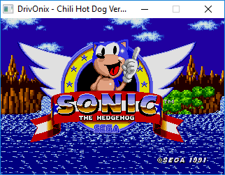
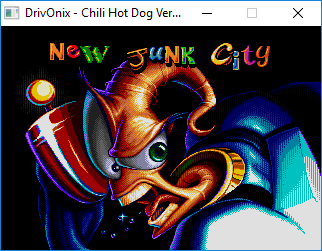
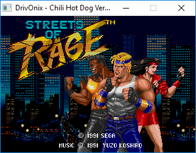
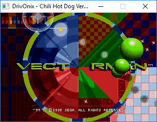
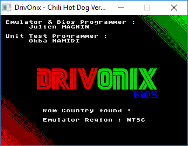

# GameBoo
```bash


 ______             _            ___              _           
|_   _ `.          (_)         .'   `.           (_)          
  | | `. \ _ .--.  __  _   __ /  .-.  \ _ .--.   __   _   __  
  | |  | |[ `/'`\][  |[ \ [  ]| |   | |[ `.-. | [  | [ \ [  ] 
 _| |_.' / | |     | | \ \/ / \  `-'  / | | | |  | |  > '  <  
|______.' [___]   [___] \__/   `.___.' [___||__][___][__]`\_] 
                                                              


  Emulator and Bios Programmer : Julien Magnin (MS-DOS1999)
  Unit Test Programmer : Okba Hamidi (acceleratorlastorder)
 ```

DrivOnix is a Windows SEGA Megadrive/Genesis emulator written in C++/CSFML.
The emulator can boot the majority of Genesis games but most games have in-game bugs.



## Installation

Release soon

### Building from source

Download or clone this repo, and run:
```sh
git clone https://github.com/MS-DOS1999/DrivOnix-Genesis_Megadrive_Emulator.git
cd DrivOnix-Genesis_Megadrive_Emulator
compile.bat
```
You need G++ MinGW 32bit
And CSFML 32bit

DrivOnix is compatible only on Windows

## Usage

Just launch DrivOnix.exe and select your favorite game, PAL or NTSC mode is automatically set by the bios.



Other options:

  You can go in CONFIG/ and change values in config.txt

## Joypad/Input

-Player 1<br/>
<kbd>Z</kbd> - Up<br/>
<kbd>Q</kbd> - Left<br/>
<kbd>S</kbd> - Down<br/>
<kbd>D</kbd> - Right<br/>
<kbd>A</kbd> - Start<br/>
<kbd>K</kbd> - A<br/>
<kbd>L</kbd> - B<br/>
<kbd>M</kbd> - C<br/><br/>

-Player 2<br/>
<kbd>↑</kbd> - Up<br/>
<kbd>←</kbd> - Left<br/>
<kbd>↓</kbd> - Down<br/>
<kbd>→</kbd> - Right<br/>
<kbd>Numpad 4</kbd> - Start<br/>
<kbd>Numpad 1</kbd> - A<br/>
<kbd>Numpad 2</kbd> - B<br/>
<kbd>Numpad 3</kbd> - C<br/><br/>

-Emulator<br/>
<kbd>Esc</kbd> - Quit Emulator<br/><br/>

### Saving 
Actually not working

## Resources
Resources were used to understand and test the Genesis hardware. Some of these include:
* <https://github.com/Emu-Docs/Emu-Docs/tree/master/Genesis>
* <https://www.nxp.com/docs/en/reference-manual/M68000PRM.pdf>
* <https://wiki.megadrive.org/index.php?title=Main_68k_memory_map>
* <https://wiki.megadrive.org/index.php?title=VDP_Ports>
* <https://wiki.megadrive.org/index.php?title=IO_Registers>
* <https://segaretro.org/images/1/18/GenesisTechnicalOverview.pdf>
* <https://segaretro.org/Category:Sega_Mega_Drive>
* <https://wiki.megadrive.org/index.php?title=MD_Rom_Header>
* <https://wiki.neogeodev.org/index.php?title=68k_instructions_timings&t=20181125164410>
* <http://www.scarpaz.com/Attic/Didattica/Scarpazza-2005-68k-1-addressing.pdf>
